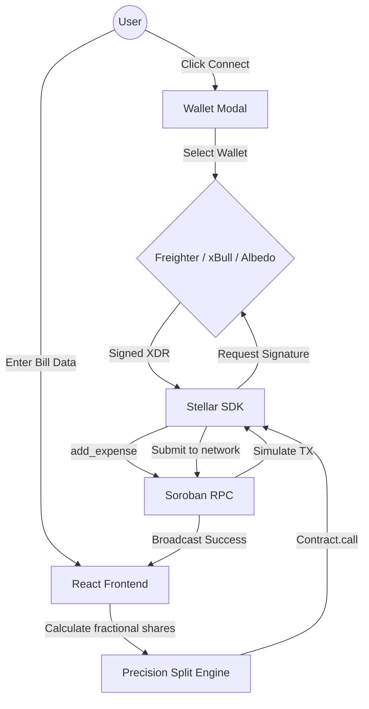

# 💸 SplitPay — Brutalist Expense Splitter

**Decentralized Bill Splitting on Stellar Soroban** — Trustless group expenses, automated fractional settlements, and fully on-chain debt tracking with a premium neo-industrial aesthetic.

[](https://stellar.org)
[](https://soroban.stellar.org)
[](https://react.dev)
[](https://rust-lang.org)
[](LICENSE)
[](https://github.com/muftiarmaan6/split-pay/actions/workflows/ci.yml)

---

## ⚙️ CI/CD Pipeline

GitHub Actions runs on every push to `main`:

- **Frontend** → Dependency caching, linting, and Vite testing (`npm test`)
- **Contracts** → Rust/Soroban WASM compilation and strict contract tests (`cargo test`)

[](https://github.com/muftiarmaan6/split-pay/actions/workflows/ci.yml)

### 🌐 Live Preview

Here are some UI screenshots of the project highlighting the newly upgraded Brutalist interface:

## Home Page (Hero Section)


## Dashboard (Wallet Connection & Meta-data)


## Expenses Page (Pending Settlements)


## Transaction Execution


*(Add your high-res screenshots to the `screenshots/Web UI Screenshots` folder)*

---

## 🎯 Problem

Group dinners, shared utilities, and event bookings always result in complicated peer-to-peer debts. Traditional fiat splitting apps suffer from:

1. **Slow Settlements** — Waiting days for bank transfers to clear
2. **Hidden Fees** — High middleman cuts on cross-border fractional payments
3. **Walled Gardens** — Both users must use the exact same proprietary app (Venmo, Splitwise, etc.)

## 💡 Solution

**SplitPay** solves this with a fully on-chain, interoperable expense splitting protocol:

| Problem               | SplitPay Solution                                          |
| --------------------- | ---------------------------------------------------------- |
| Slow Settlements      | Under 5-second finality using the Stellar Network          |
| Hidden Fees           | Micro-fractional fees (< $0.001) for on-chain settlements  |
| Walled Gardens        | Interoperable — use Freighter, xBull, Albedo, or any wallet|

---

## 🏗️ System Architecture



---

## ✨ Key Features

### ⚙️ Inter-Contract Settlement
- Debts aren't just recorded; they are settled directly.
- The SplitPay Soroban contract performs internal inter-contract calls directly to the Stellar Asset Contract (SAC) to physically transfer XLM.

### 📜 Settlement History Back-Propagation
- Every settlement is cryptographically logged.
- The UI actively tracks previously split expenses, rendering historical dates, amounts, and counterparty wallet addresses.

### 💎 Neo-Brutalist Aesthetic
- High-end, dynamic floating background vectors.
- Fluid, scrolling UX with massive `Bebas Neue` typography and sharp `IBM Plex Mono` accents.
- CRT Scanline toggle for true retro-fintech aesthetics.

### 🛡️ Smart Transaction State Machine
- Strict UI state guarding: `IDLE` → `PREPARING` → `SIGNING` → `SUBMITTING` → `CONFIRMED`.
- Context-aware error handling for network drops, insufficient balances, or rejected signatures.

---

## 🔄 Complete Trade Flow

```text
Payer                   Smart Contract                    Debtors
  │                          │                              │
  │── add_expense() ─────────►│                             │
  │   (sets payer, total,    │                              │
  │    description)          │                              │
  │                          │                              │
  │                        ──┼── DEBT LOGGED ───────────────┼──
  │                          │◄──── settle_expense() ───────│
  │                          │      (debtor signs TX)       │
  │                          │                              │
  │◄─── Transfer XLM ────────│── (Inter-Contract Call)      │
  │     (via SAC)            │                              │
  │                          │                              │
  │◄─── Expense Settled ─────│──── Status Updated ─────────►│
```

---

## 🧪 Tech Stack

| Layer               | Technology                              |
| ------------------- | --------------------------------------- |
| **Frontend**        | React 19, Vite, Tailwind CSS            |
| **State**           | React Hooks + Custom `useTransaction`   |
| **Smart Contracts** | Rust, Soroban SDK                       |
| **Blockchain**      | Stellar Testnet                         |
| **SDK**             | `@stellar/stellar-sdk`                  |
| **Wallet**          | Freighter, xBull, Albedo                |

---

## 📂 Project Structure

```text
split-pay/
├── contracts/
│   └── split_pay/
│       ├── Cargo.toml
│       └── src/
│           └── lib.rs            # Core splitting & settlement logic
├── frontend/
│   ├── src/
│   │   ├── components/
│   │   │   ├── ExpensePanel.jsx  # Primary split creation and settlement UI
│   │   │   ├── BalanceCard.jsx   # Massive typography hero state
│   │   │   ├── WalletModal.jsx   # SVG-powered wallet selector
│   │   │   ├── EventFeed.jsx     # Network event streamer
│   │   │   ├── TxProgress.jsx    # State machine UI
│   │   │   └── FloatingElements.jsx # Brutalist animated background
│   │   ├── hooks/
│   │   │   ├── useTransaction.js # Strict execution layer
│   │   │   └── useBalance.js     # TTL caching for Horizon requests
│   │   ├── lib/
│   │   │   ├── stellar.js        # Core SDK + Contract.call builders
│   │   │   ├── math.js           # Precision fractional division
│   │   │   └── wallet.js         # Wallet abstractor
│   │   └── App.jsx               # Global router and state root
│   ├── tailwind.config.js
│   └── package.json
└── .github/
    └── workflows/
        └── ci.yml                # Automated GitHub Actions Pipeline
```

---

## 🚀 Getting Started

### Prerequisites

- Node.js 18+
- Rust & Cargo
- Stellar CLI (`stellar`)
- Freighter Wallet (browser extension) — switch it to **Testnet** mode.

### Install & Run

```bash
# Clone the repository
git clone https://github.com/muftiarmaan6/split-pay.git
cd split-pay/frontend

# Install frontend dependencies
npm install

# Run development server
npm run dev
# → http://localhost:5173
```

### Build Smart Contracts

```bash
cd contracts/split_pay
cargo build --target wasm32-unknown-unknown --release
# Output: contracts/split_pay/target/wasm32-unknown-unknown/release/split_pay.wasm
```

---

## 🌐 Deployed Contract Addresses (Testnet)

| Contract              | Address                                                    |
| --------------------- | ---------------------------------------------------------- |
| `split_pay`           | `CDLZFC3SYJYDZT7K67VZ75HPJVIEUVNIXF47ZG2FB2RMQQVU2HHGCYSC` |

> Network: Stellar Testnet | RPC: `https://soroban-testnet.stellar.org`

---

## 🤝 Why Stellar?

- **< 5 second finality** — Instant debt settlement.
- **Fractional pennies** — Network fees are virtually zero.
- **Soroban** — Scalable and secure WebAssembly smart contract platform.

---

## 📄 License

MIT License — free to use, modify, and distribute.

---

<p align="center">
  Built with ❤️ on <b>Stellar</b> for the decentralized future
</p>
