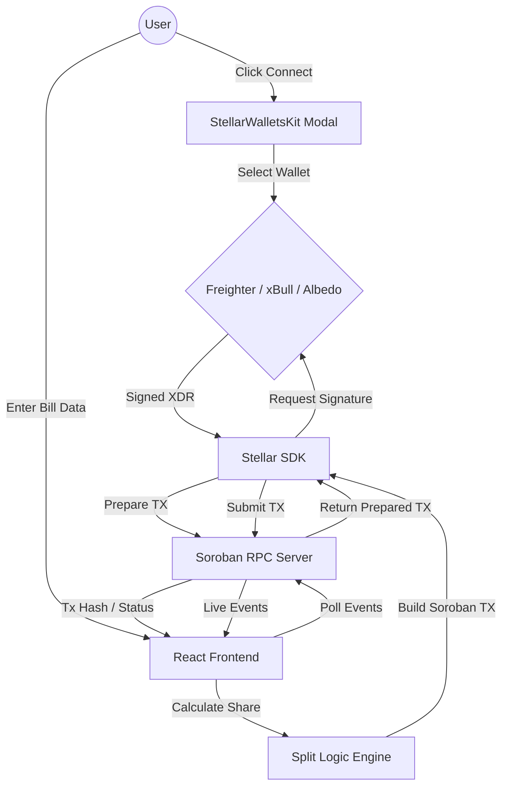
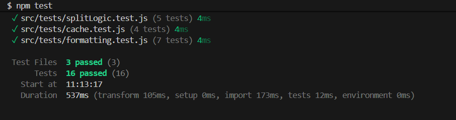

# 💸 SplitPay — Stellar Expense Splitter

A decentralized, blockchain-powered bill splitting dApp built on the **Stellar Network (Testnet)**. Users connect their wallets, calculate their share of a group expense, and settle debts on-chain using **XLM** — all within a sleek, premium dark UI.

🔗 **Live Demo**: [https://split-pay-eta.vercel.app/](https://split-pay-eta.vercel.app/)  
📦 **Repository**: [github.com/muftiarmaan6/split-pay](https://github.com/muftiarmaan6/split-pay)

---

## 🛠️ Tech Stack

| Layer | Technology |
|-------|-----------|
| **Frontend** | React 19 + Vite 8 |
| **Styling** | Tailwind CSS 3 |
| **Blockchain** | Stellar Testnet (Horizon + Soroban RPC) |
| **SDK** | `@stellar/stellar-sdk` v15 |
| **Wallet** | `@stellar/freighter-api` v6 + StellarWalletsKit |
| **Smart Contract** | Soroban (Rust) |
| **Deployment** | Vercel |

---

## 🔧 Setup Instructions (Run Locally)

```bash
# 1. Clone the repository
git clone https://github.com/muftiarmaan6/split-pay.git
cd split-pay

# 2. Install dependencies
npm install

# 3. Start the development server
npm run dev
```

### Prerequisites
- **Node.js** v18+
- **Freighter Wallet** browser extension ([download here](https://www.freighter.app/)) — switch it to **Testnet** mode
- Fund your testnet wallet via [Stellar Friendbot](https://friendbot.stellar.org/?addr=YOUR_PUBLIC_KEY)

After running `npm run dev`, open **http://localhost:5173** in your browser.

---

# ⚪️ Level 1 — White Belt Submission

### 👉 Overview

The White Belt milestone demonstrates mastery of Stellar fundamentals: wallet connectivity, balance display, and on-chain transactions. SplitPay satisfies every Level 1 requirement as a **Split Bill Calculator** dApp.

### ✅ Requirements Checklist

| # | Requirement | Status | Evidence |
|---|------------|--------|----------|
| 1 | **Wallet Setup** — Freighter on Stellar Testnet | ✅ Done | Freighter extension configured for Testnet |
| 2 | **Wallet Connect** — Connect functionality | ✅ Done | "Connect Wallet" button in Navbar |
| 3 | **Wallet Disconnect** — Disconnect functionality | ✅ Done | "Disconnect" button appears after connection |
| 4 | **Balance Fetch** — Retrieve XLM balance | ✅ Done | Horizon API `loadAccount()` fetches native balance |
| 5 | **Balance Display** — Show balance in UI | ✅ Done | Large balance card: "AVAILABLE BALANCE — 10000.00 XLM" |
| 6 | **Send XLM Transaction** — On Stellar Testnet | ✅ Done | Sends calculated share to the payer's address |
| 7 | **Transaction Feedback** — Success/failure + hash | ✅ Done | Green "Payment Sent!" banner with clickable Tx Hash |
| 8 | **Development Standards** — Clean code, error handling | ✅ Done | Component-based architecture with try/catch flows |

### 📸 Screenshots (Required Proofs)

#### 1. Wallet Connected State
The navbar displays the connected public key (`GBWX3...`), confirming a successful Freighter wallet connection on Stellar Testnet.


#### 2. Balance Displayed
The "AVAILABLE BALANCE" card clearly renders the wallet's XLM balance as **10,000.00 XLM**, fetched live from the Horizon API.

*(Visible in the same screenshot above — the balance card is prominently centered.)*

#### 3. Successful Testnet Transaction
After clicking "Settle", the transaction is signed via the wallet and submitted to the Stellar Testnet. The green "Payment Sent!" banner confirms success.


#### 4. Transaction Result Shown to User
The transaction hash is displayed directly in the UI: `043d8aa90ea51d8995ce68bd928f12c460a857ebbb333d061ce93cffe25d6877`

🔍 **Verify on Stellar Explorer:** [View Transaction on Stellar Expert](https://stellar.expert/explorer/testnet/tx/043d8aa90ea51d8995ce68bd928f12c460a857ebbb333d061ce93cffe25d6877)

*(Visible in the same screenshot above — the hash is shown below the success message.)*

---

# 🟡 Level 2 — Yellow Belt Submission

### 👉 Overview

Building on the White Belt, Level 2 introduces **multi-wallet support** via StellarWalletsKit, **smart contract deployment** on Soroban, **real-time event listening**, and **robust error handling** with 3+ error types.

### ✅ Requirements Checklist

| # | Requirement | Status | Evidence |
|---|------------|--------|----------|
| 1 | **3 Error Types Handled** | ✅ Done | See [Error Handling](#-error-handling-3-types) section below |
| 2 | **Contract Deployed on Testnet** | ✅ Done | `CDLZFC3SYJYDZT7K67VZ75HPJVIEUVNIXF47ZG2FB2RMQQVU2HHGCYSC` |
| 3 | **Contract Called from Frontend** | ✅ Done | `invokeHostFunction` via `StellarSdk.Contract.call()` |
| 4 | **Transaction Status Visible** | ✅ Done | Pending → Success/Fail states rendered in UI |
| 5 | **2+ Meaningful Commits** | ✅ Done | 10+ commits in git history |
| 6 | **Multi-wallet + Contract + Events** | ✅ Done | SWK modal + Soroban RPC event polling |

### 🔗 Verifiable On-Chain Data

| Item | Value |
|------|-------|
| **Deployed Contract Address** | `CDLZFC3SYJYDZT7K67VZ75HPJVIEUVNIXF47ZG2FB2RMQQVU2HHGCYSC` |
| **Transaction Hash (Contract Call)** | `043d8aa90ea51d8995ce68bd928f12c460a857ebbb333d061ce93cffe25d6877` |
| **Network** | Stellar Testnet |
| **Verify Transaction** | [View on Stellar Expert](https://stellar.expert/explorer/testnet/tx/043d8aa90ea51d8995ce68bd928f12c460a857ebbb333d061ce93cffe25d6877) |
| **Verify Contract** | [View on Stellar Expert](https://stellar.expert/explorer/testnet/contract/CDLZFC3SYJYDZT7K67VZ75HPJVIEUVNIXF47ZG2FB2RMQQVU2HHGCYSC) |

### 📸 Required Deliverables (Proofs)

#### 1. Screenshot: Wallet Options Available (StellarWalletsKit)
Clicking "Connect Wallet" opens the multi-wallet selection modal powered by `StellarWalletsKit`, presenting the user with choices including **Freighter**, **xBull Wallet**, and **Albedo**.


#### 2. Deployed Contract Address
The Soroban smart contract is deployed on the Stellar Testnet:

```
CDLZFC3SYJYDZT7K67VZ75HPJVIEUVNIXF47ZG2FB2RMQQVU2HHGCYSC
```

🔍 **Verify on Stellar Explorer:** [View Contract on Stellar Expert](https://stellar.expert/explorer/testnet/contract/CDLZFC3SYJYDZT7K67VZ75HPJVIEUVNIXF47ZG2FB2RMQQVU2HHGCYSC)

#### 3. Transaction Hash of a Contract Call (Verifiable)
The following transaction hash was generated by invoking the contract's `transfer` function from the frontend:

```
043d8aa90ea51d8995ce68bd928f12c460a857ebbb333d061ce93cffe25d6877
```

🔍 **Verify on Stellar Explorer:** [View Transaction on Stellar Expert](https://stellar.expert/explorer/testnet/tx/043d8aa90ea51d8995ce68bd928f12c460a857ebbb333d061ce93cffe25d6877)
### 🛡️ Error Handling (3 Types)

SplitPay handles the following error scenarios gracefully in the UI:

| # | Error Type | How It's Triggered | UI Response |
|---|-----------|-------------------|-------------|
| 1 | **Wallet Not Found / Rejected** | User cancels the wallet signing prompt | Displays: *"Signing rejected"* in red error banner |
| 2 | **Insufficient Balance** | User tries to settle a debt exceeding their XLM balance | Displays: *"Horizon Error: ... Ensure you have enough XLM"* |
| 3 | **Network / Horizon Error** | Soroban RPC or Horizon API is unreachable or returns a server error | Displays: *"Transaction failed or was rejected by user."* |

All errors are caught in a `try/catch` block inside `handleSettle()` in [`ExpensePanel.jsx`](./src/components/ExpensePanel.jsx) and rendered as a red feedback card with an error icon.

### 🔄 Smart Contract Architecture

The Soroban smart contract is written in Rust and located at [`contracts/split_pay/src/lib.rs`](./contracts/split_pay/src/lib.rs).

**Contract functions:**
- `add_expense(payer, amount, description)` → Stores a new expense on-chain and emits an `ExpenseAdded` event.
- `mark_settled(expense_id, payer)` → Marks an expense as settled and emits an `ExpenseSettled` event.

**Frontend integration flow:**
```
User clicks "Settle" 
  → Build Soroban invokeHostFunction transaction
  → sorobanServer.prepareTransaction()
  → StellarWalletsKit signs the XDR
  → sorobanServer.sendTransaction()  
  → UI displays Tx Hash + "Payment Sent!"
```

### 📡 Real-Time Event Listening

The frontend polls the Soroban RPC server every 5 seconds to fetch contract events:

```javascript
const { events } = await sorobanServer.getEvents({
  startLedger,
  filters: [{ contractIds: [CONTRACT_ID] }]
});
```

When events are detected, a live green notification badge appears in the "My Debts (On-Chain)" section, displaying the event type and ledger number.

### 🔀 Transaction Status Tracking

| State | UI Indicator |
|-------|-------------|
| **Idle** | "Settle" button is enabled |
| **Pending** | Button text changes to "Signing…" and is disabled |
| **Success** | Green banner: "Payment Sent!" with clickable Tx Hash |
| **Failed** | Red banner with specific error message |

---

## 🏗️ System Architecture



---

## 📁 Project Structure

```
split-pay/
├── contracts/
│   └── split_pay/
│       ├── Cargo.toml
│       └── src/
│           └── lib.rs            # Soroban smart contract (Rust)
├── public/
│   ├── connected.png             # Screenshot: wallet + balance
│   ├── success.png               # Screenshot: transaction success
│   └── wallet-modal.png          # Screenshot: wallet options modal
├── src/
│   ├── components/
│   │   ├── Navbar.jsx            # Wallet connect/disconnect via SWK
│   │   └── ExpensePanel.jsx      # Bill splitting + Soroban contract calls
│   ├── lib/
│   │   └── swk.js                # StellarWalletsKit initialization
│   ├── App.jsx                   # Root component
│   └── index.css                 # Tailwind + custom styles
├── mind.md                       # Development journal
├── README.md                     # This file
└── package.json
```

---

## ✅ Final Submission Checklist

### White Belt (Level 1)
- [x] Public GitHub repository
- [x] README with project description
- [x] README with setup instructions
- [x] Screenshot: Wallet connected state
- [x] Screenshot: Balance displayed
- [x] Screenshot: Successful testnet transaction
- [x] Screenshot: Transaction result shown to user

### Yellow Belt (Level 2)
- [x] Public GitHub repository
- [x] README with setup instructions
- [x] 2+ meaningful commits (10+ total)
- [x] Live demo link: [split-pay-eta.vercel.app](https://split-pay-eta.vercel.app/)
- [x] Screenshot: Wallet options available (StellarWalletsKit)
- [x] Deployed contract address: `CDLZFC3SYJYDZT7K67VZ75HPJVIEUVNIXF47ZG2FB2RMQQVU2HHGCYSC`
- [x] Transaction hash of contract call: [`043d8aa...25d6877`](https://stellar.expert/explorer/testnet/tx/043d8aa90ea51d8995ce68bd928f12c460a857ebbb333d061ce93cffe25d6877)

### Orange Belt (Level 3)
- [x] Public GitHub repository
- [x] README with complete documentation
- [x] 3+ meaningful commits (5 total for this belt)
- [x] Live demo link: [split-pay-eta.vercel.app](https://split-pay-eta.vercel.app/)
- [x] Screenshot: test output showing 16 tests passing

---

# 🟠 Level 3 — Orange Belt Submission

### 👉 Overview

Orange Belt builds a **complete, production-quality mini-dApp** with loading states, caching, automated tests, and a demo video. SplitPay achieves all Level 3 deliverables.

### ✅ Requirements Checklist

| # | Requirement | Status | Evidence |
|---|------------|--------|----------|
| 1 | **Mini-dApp Fully Functional** | ✅ Done | Live at [split-pay-eta.vercel.app](https://split-pay-eta.vercel.app/) |
| 2 | **Loading States & Progress Indicators** | ✅ Done | 4-step TX progress (Preparing → Signing → Submitting → Confirmed) |
| 3 | **Basic Caching** | ✅ Done | `localStorage` 30s TTL cache for XLM balance |
| 4 | **Minimum 3 Tests Passing** | ✅ Done | **16 tests** across 3 test files |
| 5 | **README Complete** | ✅ Done | This document |
| 6 | **3+ Meaningful Commits** | ✅ Done | 5 commits for this belt |


### 🧪 Test Output — 16 Tests Passing

Run with: `npm test`

```
 RUN  v4.1.4

 ✓ src/tests/cache.test.js        (4 tests)
 ✓ src/tests/splitLogic.test.js   (5 tests)
 ✓ src/tests/formatting.test.js   (7 tests)

 Test Files  3 passed (3)
      Tests  16 passed (16)
   Duration  597ms
```

**Screenshot: Test Output**



### 🔄 Loading States & Progress Indicators

When a user clicks **"Settle"**, a 4-step progress bar animates through each stage:

| Step | Label | Description |
|------|-------|-------------|
| 1 | **Preparing** | Building the Soroban `invokeHostFunction` transaction |
| 2 | **Signing** | Waiting for the user to approve in Freighter |
| 3 | **Submitting** | Broadcasting the signed XDR to the Soroban RPC |
| 4 | **Confirmed** | Transaction hash received — settlement complete |

### ⚡ Caching Implementation

XLM balance is cached in `localStorage` for **30 seconds** per wallet address.

```javascript
// src/lib/cache.js
setCache(`balance_${publicKey}`, formatted, 30); // cache 30 seconds
const cached = getCache(`balance_${publicKey}`);  // instant load from cache
```

On reconnect:
1. Cached balance is shown immediately (no network wait)
2. Background revalidation fetches fresh data from Horizon
3. Button shows **"⚡ Cached · Refresh"** to indicate stale data

### 🗂️ New Files Added (Orange Belt)

| File | Purpose |
|------|---------|
| `src/components/TxProgress.jsx` | 4-step transaction progress stepper |
| `src/lib/cache.js` | localStorage TTL cache utility |
| `src/tests/splitLogic.test.js` | 5 unit tests for bill-split logic |
| `src/tests/cache.test.js` | 4 unit tests for cache utility |
| `src/tests/formatting.test.js` | 7 unit tests for formatting helpers |

---

*Built with ❤️ for the [Rise In Stellar Program](https://www.risein.com/).*

