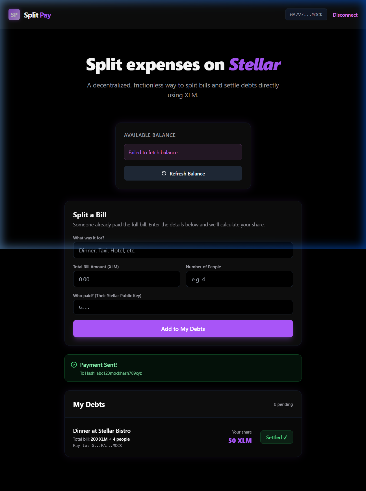
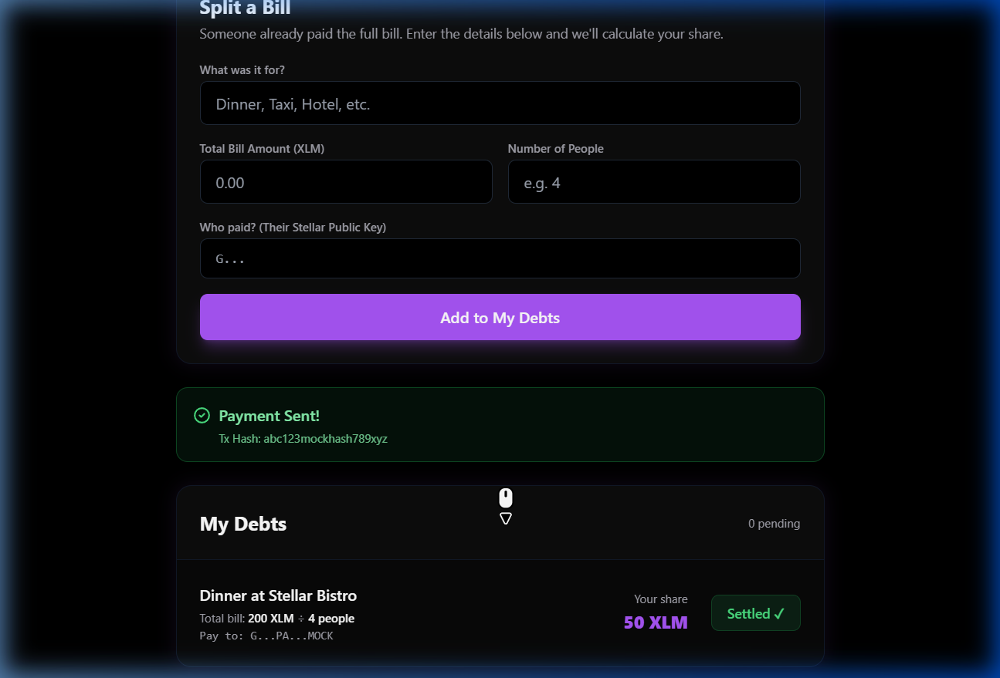
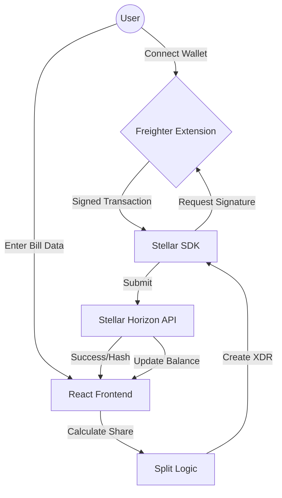

**SplitPay** is a premium, blockchain-based expense splitting application built on the **Stellar Network**. It allows users to seamlessly split bills, calculate shares, and settle debts directly using XLM on the Stellar Testnet.

🔗 **Live Demo**: [https://split-pay-eta.vercel.app/](https://split-pay-eta.vercel.app/)

---

## ⚪️ Level 1 & 🟡 Level 2 (White & Yellow Belt Submission)

This project is a successful submission for both the **Stellar Level 1 (White Belt)** and **Level 2 (Yellow Belt)** milestones. It implements core fundamentals, comprehensive error handling, multi-wallet support, and sets up Soroban contract architecture.

### 🎯 Overview
In this level, I have built a fully functional Stellar dApp that:
- ✅ Connects natively to **multiple wallets** via StellarWalletsKit (Freighter, xBull, Albedo).
- ✅ Fetches and displays real-time **XLM Balances** from the Stellar Testnet.
- ✅ Executes **Native XLM Transactions** to settle shared expenses.
- ✅ Provides immediate **Transaction Feedback** (hashes and success states).
- ✅ Detects unsupported wallets and **Insufficient Funds**, displaying robust error handling.
- ✅ Scaffolds the foundation for **Soroban Smart Contracts** to log debts on-chain.

---

## 📸 Screenshots

| Wallet Connected & Balance | Transaction Success & Feedback |
|:---:|:---:|
|  |  |

---

## 🚀 Key Features

- **Multi-Wallet Support**: Powered by `StellarWalletsKit`, letting users connect their preferred Stellar ecosystem wallet.
- **Dynamic Split Logic**: Input a total bill and the number of people; the app instantly calculates your precise share.
- **One-Click Settlement**: Pay the calculated share directly to the person who covered the bill with a single transaction.
- **Robust Error Handling**: Real-time checking for un-funded accounts, declined transactions, and Horizon network issues.
- **Soroban Ready**: Contract scaffolding is set up (`lib.rs`) to migrate the debts to on-chain state vectors.
- **Premium Dark UI**: Built with a modern, glassmorphic aesthetic using Tailwind CSS.

---

## 🛠️ Tech Stack

- **Framework**: [React](https://reactjs.org/) + [Vite](https://vitejs.dev/)
- **Blockchain**: [Stellar Network](https://www.stellar.org/) (Testnet)
- **API/SDK**: [@stellar/stellar-sdk](https://www.npmjs.com/package/@stellar/stellar-sdk), [@stellar/freighter-api](https://www.npmjs.com/package/@stellar/freighter-api)
- **Styling**: [Tailwind CSS](https://tailwindcss.com/)

---

## 🏗️ System Architecture & Design

SplitPay follows a decentralized client-side architecture that interacts directly with the Stellar blockchain through the Horizon API and the Freighter wallet provider.

### 🧩 Core Components
1. **Frontend Layer**: A responsive React SPA styled with Tailwind CSS, responsible for UI/UX and calculation logic.
2. **Provider Layer (Freighter)**: Handles secure wallet connection and transaction signing without exposing private keys.
3. **Blockchain Layer (Stellar)**: The source of truth for balances and the settlement ledger for all payments.

### 🔄 Data Flow


---

## 🔧 Local Setup

1. **Clone the repository**:
   ```bash
   git clone <repository-url>
   cd split-pay
   ```

2. **Install dependencies**:
   ```bash
   npm install
   ```

3. **Install Freighter Wallet**:
   Ensure you have the [Freighter browser extension](https://www.freighter.app/) installed and set to **Testnet**.

4. **Run the development server**:
   ```bash
   npm run dev
   ```

5. **Open the app**:
   Navigate to `http://localhost:5173`.

---

## ✅ Submission Checklist Status

- [x] Public GitHub repository
- [x] Comprehensive README.md
- [x] Setup instructions included
- [x] Screenshots of connected state & balance
- [x] Screenshots of successful transaction & verification

---

*Built with ❤️ for the Rise In Stellar Program.*
